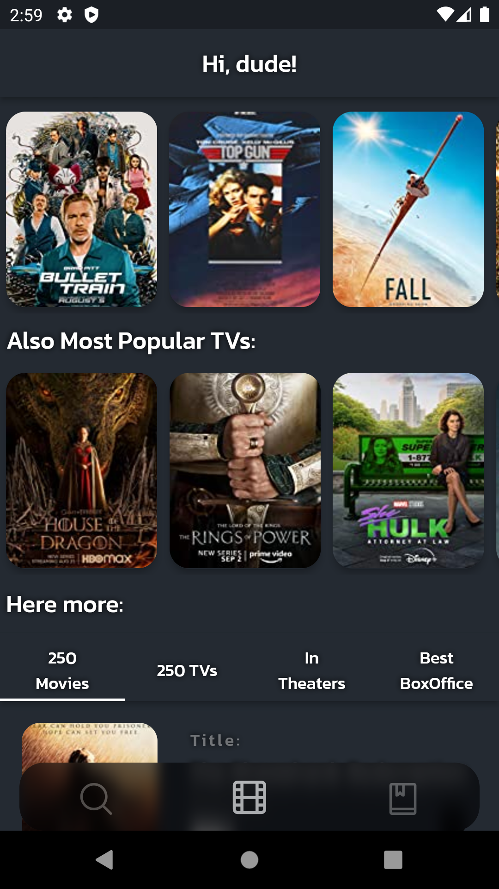
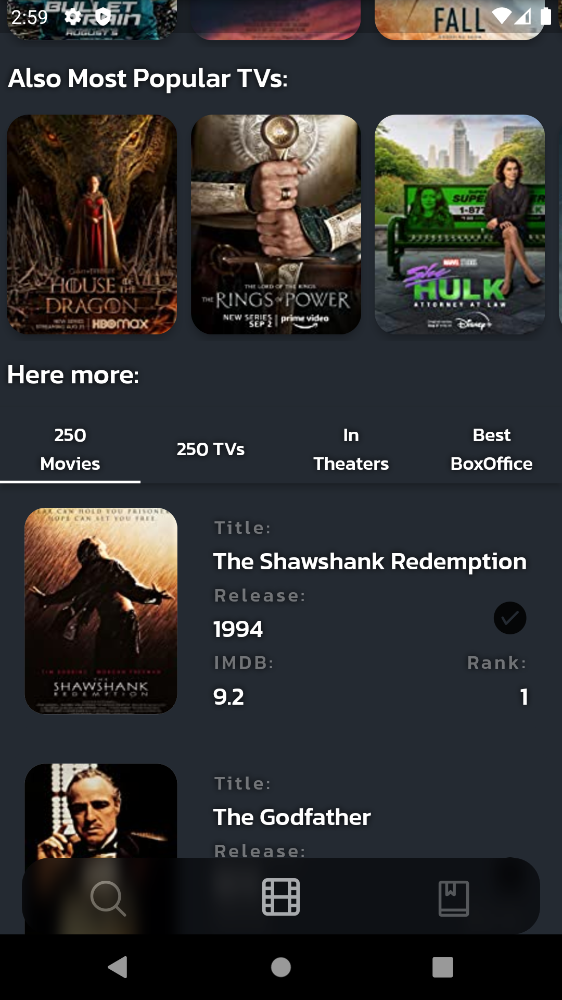
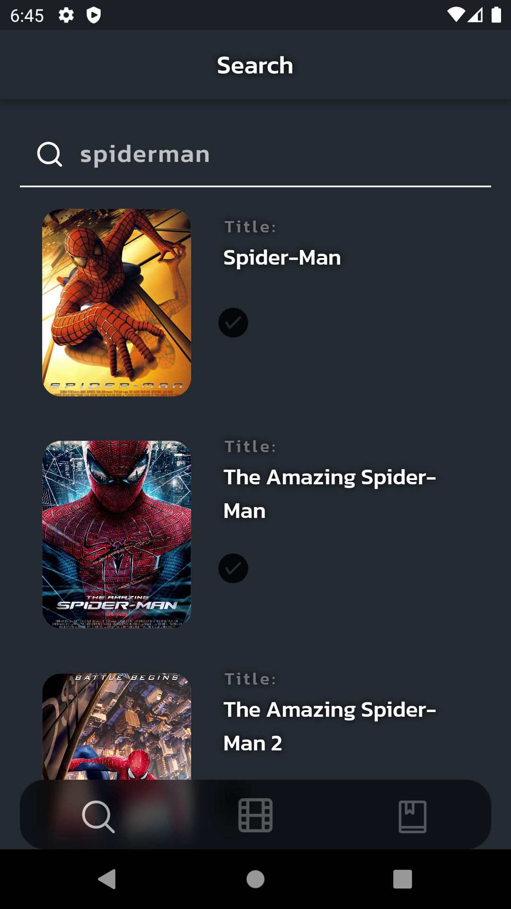

# TMDB_X

TMDB_X is Dart / Flutter Android app which visualises data provided by IMDB API 
that could be useful for phone users.

<b> Current features:</b> 
<ul>
<li><b>Open page: </b> 
This page contains information about the most popular films and TV series presented in the carousel of their posters, and then there is a scrollable block with columns about the best films and TV series according to imdb and others.
<li><b>Search page: </b> 
Search for movies, TV series using the IMDB database.
</ul>

 

<b> Currently in development:</b> 
<ul>
<li><b>Error page: </b> 
Error page without correct navigation and simple decoration.
<li><b>WatchList page:</b> 
The page where the movies will be viewed.
</ul>

# Update map:

<b>Update at the end of August 2022:</b> 
<ul>
<li>The ErrorPage needs improvement;
<li>Add pictures to OpenPages's AllTimeBoxOffice from kinopoisk API;
</ul>

<b>Upadate sometime in September 2022:</b>
<ul>
<li>Add Movie / TVs page;
<li>Optimize requests;
<li>Add "View more" for OpenPagess' tabbar lists
<li>Possible adding of user's rating;
</ul>

# Resources
<b>This project uses resources:</b>
<ul>
<li>IMDb API documentation - https://imdb-api.com/</li>
<li>kinopoisk API documentation - https://kinopoisk.dev/documentation.html</li>
<li>TaskBoard - https://trello.com/b/UPjVPkER/tmdb-mobapp </li>
</ul>